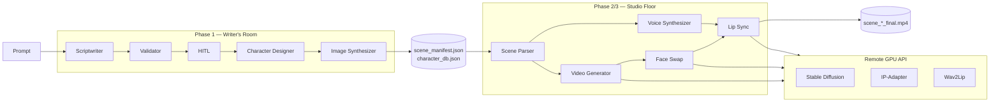

# Project Montage

**AI-powered animated short-film pipeline — from a creative prompt to lip-synced scene videos.**

Project Montage is a multi-agent system that turns natural-language story ideas (or uploaded screenplays) into structured scripts, character portraits, synthesized dialogue, and composed MP4 scenes. Agents are orchestrated with [LangGraph](https://github.com/langchain-ai/langgraph); heavy vision workloads (Stable Diffusion, IP-Adapter, Wav2Lip) run on a remote GPU service exposed over HTTP.

Developed for **CS-4015 Agentic AI** (FAST-NUCES) as the course capstone: *AI-Powered Animated Video Generation — From Prompt to Polished Short Film*.

---

## Table of contents

- [Features](#features)
- [Architecture](#architecture)
- [Tech stack](#tech-stack)
- [Prerequisites](#prerequisites)
- [Installation](#installation)
- [Configuration](#configuration)
- [Usage](#usage)
- [Outputs](#outputs)
- [Project structure](#project-structure)
- [Diagrams](#diagrams)
- [Repository](#repository)

---

## Features

| Layer | Name | Responsibility |
|-------|------|----------------|
| **Phase 1** | Writer's Room | Script generation or manual intake, validation, character design, portrait synthesis |
| **Phase 2** | Studio Floor (audio) | Per-line TTS, scene-level WAV merge, timing metadata |
| **Phase 3** | Studio Floor (video) | Wide B-roll generation, identity injection, Wav2Lip close-ups, PiP composition with subtitles |
| **Phase 4** | Web UI | Streamlit app for full pipeline runs, per-phase execution, and video preview |
| **Phase 5** | Edit & undo | Natural-language edit intents, targeted re-runs, versioned snapshots with revert |

**Highlights**

- **Dual script modes** — autonomous LLM screenwriting or manual screenplay upload
- **MCP tool discovery** — agents resolve tools through a central registry (no hard-coded API imports in agent logic)
- **Persistent memory** — FAISS vector store plus JSON entry log for cross-run continuity
- **Human-in-the-loop** — optional script approval in interactive terminals; auto-approve in CI/Streamlit
- **Visual-novel composition** — Ken Burns background, timed character PiP overlays, burned-in subtitles
- **GPU-flexible backend** — Colab quick tunnel, RunPod proxy, or any compatible FastAPI host

---

## Architecture

End-to-end flow:



Phase 1 and Phase 2/3 each use a dedicated LangGraph `StateGraph`. The Studio Floor fans out per-scene tasks, converges audio and video branches at lip-sync composition, and writes artifacts under `outputs/`.

See also: [`docs/diagrams/system_architecture.png`](docs/diagrams/system_architecture.png), [`docs/diagrams/phase1_langgraph.png`](docs/diagrams/phase1_langgraph.png), [`docs/diagrams/phase2_langgraph.png`](docs/diagrams/phase2_langgraph.png).

---

## Tech stack

| Concern | Technology |
|---------|------------|
| Orchestration | LangGraph |
| Schemas | Pydantic v2 |
| Script LLM | Groq (`llama-3.1-8b-instant`) with Ollama fallback |
| Memory | FAISS + JSON entries |
| TTS | edge-tts (Microsoft Neural voices) |
| Image / video ML | Stable Diffusion 1.5, IP-Adapter, Wav2Lip (remote GPU) |
| Assembly | MoviePy, OpenCV, ffmpeg |
| Web UI | Streamlit |
| GPU server | FastAPI (`colab_sd_api.txt` / `runpod_startup.py`) |

---

## Prerequisites

- **Python 3.10+**
- **ffmpeg** on your PATH (required for audio/video muxing locally)
- **edge-tts** CLI (installed with the project; used by the voice synthesizer)
- **Groq API key** (recommended for Phase 1 script quality) — copy `config/groq_api.example.txt` to `config/groq_api.txt`
- **Ollama** (optional local fallback for script generation and edit-intent classification)
- **GPU backend** — a running instance of the FastAPI server from `colab_sd_api.txt` or `runpod_startup.py`, reachable via HTTPS

---

## Installation

```bash
git clone https://github.com/arb7715/Project-Montage.git
cd Project-Montage

python -m venv venv
# Windows
venv\Scripts\activate
# macOS / Linux
source venv/bin/activate

pip install -r requirements.txt -r requirements_phase2.txt
pip install edge-tts opencv-python "imageio[ffmpeg]"
```

---

## Configuration

### GPU backend URL

1. Start the GPU server (Colab notebook cells in `colab_sd_api.txt`, or `python runpod_startup.py` on RunPod).
2. Copy the public base URL (no trailing slash).
3. Save it as a single line in `config/colab_api.txt` (see `config/colab_api.example.txt`).

Verify connectivity:

```bash
python -m src.smoke_test_colab
```

All four checks (`/health`, `/generate`, `/face_swap`, `/lip_sync`) should return HTTP 200.

### Groq API key (Phase 1)

```bash
cp config/groq_api.example.txt config/groq_api.txt
# Edit groq_api.txt and paste your key (file is gitignored)
```

### Optional: Ollama

If Groq is unavailable, the scriptwriter and edit agent fall back to a local Ollama model (e.g. `llama3.2:1b`).

---

## Usage

### Phase 1 — Writer's Room

Autonomous generation:

```bash
python -m src.main --mode autonomous --prompt "Two colleagues confront a past mistake in a morning meeting." --num-scenes 2
```

Manual screenplay:

```bash
python -m src.main --mode manual --script-file path/to/screenplay.txt
```

**Produces:** `outputs/scene_manifest.json`, `outputs/character_db.json`, `outputs/images/<character>.png`

### Phase 2 & 3 — Studio Floor

Requires Phase 1 artifacts:

```bash
python -m src.main_phase2
```

Optional paths:

```bash
python -m src.main_phase2 \
  --scene-manifest outputs/scene_manifest.json \
  --character-db outputs/character_db.json \
  --output-dir outputs
```

**Produces:** per-scene audio under `outputs/audio/`, composed videos at `outputs/raw_scenes/scene_<id>_final.mp4`, and `outputs/timing_manifest.json`. Each full run also creates a version snapshot under `outputs/versions/`.

### Web interface (Phase 4 & 5)

```bash
streamlit run src/ui/app.py
```

- **Pipeline** — run Phase 1, Phase 2/3, or the full pipeline; configure the GPU URL in the sidebar
- **Edit & Undo** — natural-language edits (voice tone, visuals, subtitles, etc.) with targeted re-runs
- **History** — list snapshots and revert to a prior version

### Edit agent (CLI)

The edit agent is invoked from the Streamlit UI. It classifies free-text requests, re-runs only the affected agents, and snapshots state via `StateManager`.

---

## Outputs

| Path | Description |
|------|-------------|
| `outputs/scene_manifest.json` | Structured screenplay (scenes, dialogues, visual cues) |
| `outputs/character_db.json` | Character profiles and portrait paths |
| `outputs/images/` | Reference portraits per character |
| `outputs/audio/` | Per-line and merged scene WAV files |
| `outputs/raw_scenes/scene_*_final.mp4` | Final composed scene videos |
| `outputs/timing_manifest.json` | Per-line audio timing for downstream tooling |
| `outputs/versions/vNNNN/` | Versioned snapshots for undo/revert |
| `outputs/memory/` | FAISS index and memory entry log |

Generated assets under `outputs/` are gitignored; reproduce them locally after cloning.

---

## Project structure

```
Project-Montage/
├── config/                  # API URL templates (secrets gitignored)
├── docs/diagrams/           # Architecture PNGs
├── scripts/
│   └── generate_diagrams.py
├── src/
│   ├── main.py              # Phase 1 entrypoint
│   ├── main_phase2.py       # Phase 2+3 entrypoint
│   ├── workflow.py          # Phase 1 LangGraph
│   ├── workflow_phase2.py   # Phase 2+3 LangGraph
│   ├── schema.py            # Shared Pydantic models
│   ├── agents/              # Specialized agents
│   ├── state/               # StateManager (versioning)
│   ├── ui/app.py            # Streamlit application
│   └── utils/               # MCP registry, memory, prompts
├── colab_sd_api.txt         # Colab GPU server cells
├── runpod_startup.py        # RunPod GPU server (persistent volume)
├── requirements.txt
└── requirements_phase2.txt
```

---

## Diagrams

Regenerate architecture figures after graph or agent changes:

```bash
python scripts/generate_diagrams.py
```

---

## Repository

- **GitHub:** [github.com/arb7715/Project-Montage](https://github.com/arb7715/Project-Montage)
- **Internal handover / dev notes:** `PROJECT_CONTEXT.md` (not required for end users)

---

## License

Academic course project. All rights reserved unless otherwise stated by the authors and institution.
